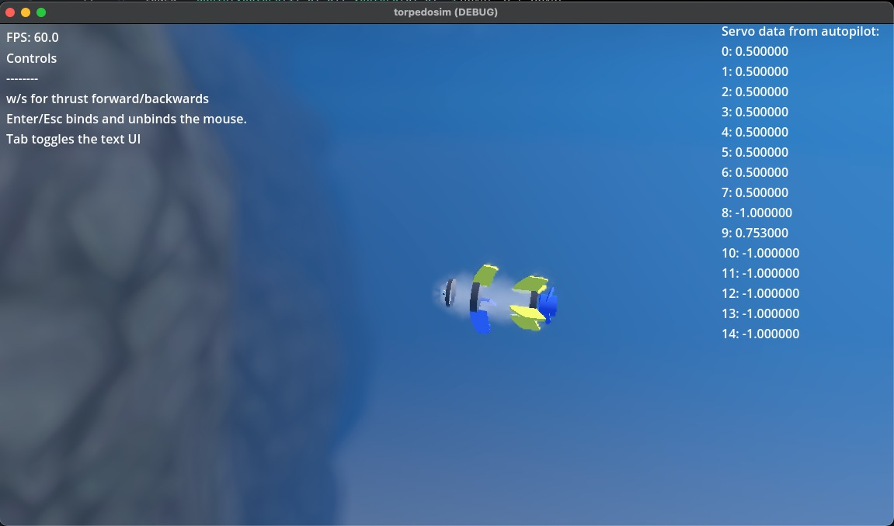

Torped-style AUV simulator for development of a frame on ArduSub.

to use, launch the simulator. and then run the ArduSub code.

```./Tools/autotest/sim_vehicle.py -S 1 -v sub -L RATBeach --model JSON --frame vectored_6dof```

the vectored_6dof frame loads sub-6dof.parm, which is one of the first things we need to modify.

